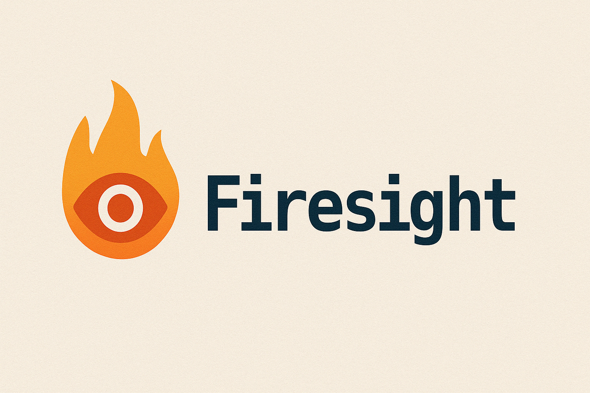

# Firesight

  

## Summary
A dashboard built to assist regional governments in monitoring and allocating proper resources in order to efficiently address wildfires. We utilize public data on demographics, weather, fire history, access to technology, language, income, evacuation ability (car access), water access, broadband access,and emergency service staffing to create a comprehensive visualization. We also utilize AI agents to assist in suggesting changes or modifications to existing systems to improve the efficiency of wildfire response.

## Try Now

## How to install

## How to use

## Sources
Census 

[LA](https://labormarketinfo.edd.ca.gov/file/Census2022/LAdp2022.pdf)

[Monterey](https://labormarketinfo.edd.ca.gov/file/Census2022/montedp2022.pdf)

[Yolo](https://labormarketinfo.edd.ca.gov/file/Census2022/yolodp2022.pdf)

[Shasta](https://labormarketinfo.edd.ca.gov/file/Census2022/shastdp2022.pdf)

Fire Districts:

[LA](https://geohub.lacity.org/datasets/691409b93f8d4d9e81f9a593c53ed069_3/explore?location=34.018933%2C-118.412043%2C9.93)

[Monterey](https://montereycountyopendata-12017-01-13t232948815z-montereyco.opendata.arcgis.com/datasets/MontereyCo::fire-protection-districts-1/explore)

[Yolo](https://data.sacog.org/datasets/865c671f824b46548332ade360077141_1/about)

[Shasta](https://data-shasta.opendata.arcgis.com/datasets/a3af0c1268ca41ed86af626e0a22effb_7/explore?location=40.738145%2C-122.164438%2C9.42)
